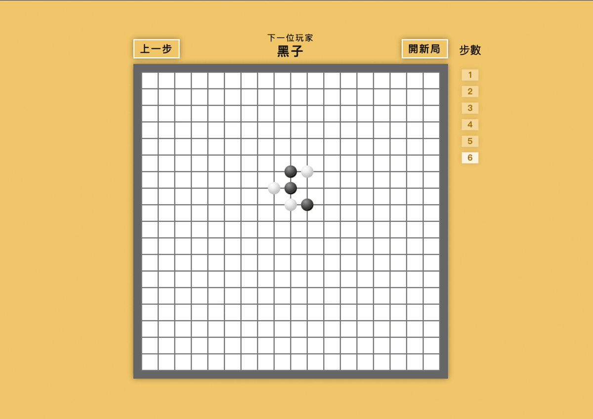

# Reac 五子棋
[DEMO](https://sage90180.github.io/react-gomoku/)

   

## 五子棋功能
* 重新開始功能
* 悔棋功能，返回上一步
* 具備紀錄棋譜功能，能返回之前紀錄
* 計算獲勝者

## 使用技術
* 以 JSX 語法撰寫元件
* 使用 styled-component 撰寫
* 使用 funciton component 及 useState 管理狀態
